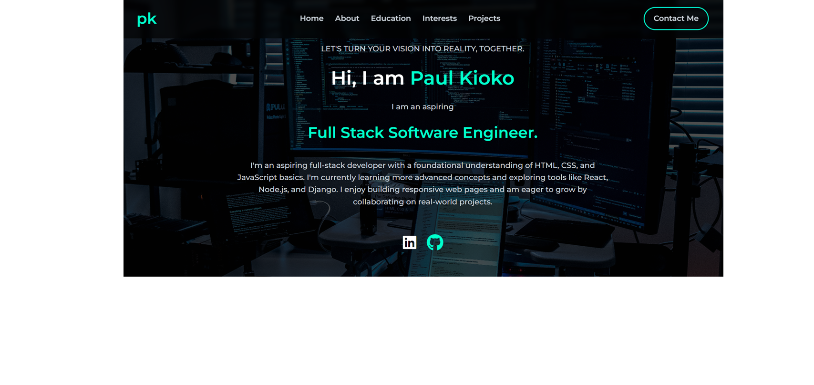
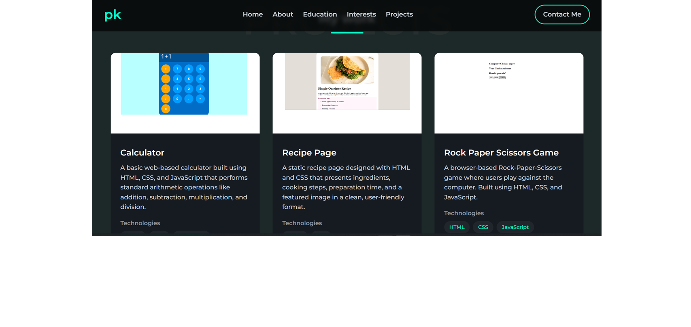

---

# 🚀 Portfolio Website



A sleek, fully responsive personal portfolio website built using only **HTML5** and **CSS3**. This project demonstrates frontend development skills, modern UI design, and accessibility principles—all optimized for performance and simplicity, without relying on JavaScript.

---

## 🎯 Purpose

This portfolio serves as a digital identity hub showcasing **projects, skills, and educational background**, as well as a way for potential collaborators, recruiters, or clients to connect with me easily.

---

## 🌟 Key Features

* ✅ **Responsive Design** – Optimized layout across mobile, tablet, and desktop
* 🎨 **Modern UI** – Clean typography, consistent spacing, and visual hierarchy
* 🧭 **Intuitive Navigation** – Smooth scrolling and section-based layout
* 🧠 **Interactive Elements** – Hover effects, call-to-action buttons, and icon animations
* 💡 **Dark/Light Theme Support** – Pure CSS-based theme toggle
* 🖋️ **Typewriter Animation** – For the hero introduction
* 📬 **Contact Section** – Designed for easy outreach (frontend only)

---

## 📁 Sections Breakdown

* **Hero** – Animated intro with a typewriter effect
* **About Me** – Overview and a fun code-snippet style design
* **Education** – Timeline format for academic milestones
* **Skills** – Grid display with icons
* **Projects** – Gallery of featured work
* **Contact** – Form and links for reaching out

---

## 🛠️ Technologies Used

| Tech             | Purpose                       |
| ---------------- | ----------------------------- |
| `HTML5`          | Page structure                |
| `CSS3`           | Styling, layout, transitions  |
| `Flexbox & Grid` | Responsive design             |
| `Google Fonts`   | Clean and readable typography |
| `Font Awesome`   | Icons for skills/social links |

---

## 🧪 Local Setup & Usage

### ✅ Prerequisites

* Any modern web browser (e.g., Chrome, Firefox, Safari)
* Code editor (VS Code recommended)

### 💻 Getting Started

1. Clone this repository:

   ```bash
   git clone https://github.com/PaulKioko420/paul-kioko-portfolio.git
   ```
2. Navigate to the folder:

   ```bash
   cd paul-kioko-portfolio
   ```
3. Open `index.html` in your browser or drag the file into VS Code and use **Live Server**.

---

## 🌐 Live Demo

👉 [Check out the Live Portfolio]( https://paulkioko420.github.io/paul-kioko-portfolio/) 

---

## 🧬 Project Structure

```
paul-kioko-portfolio/
├── index.html                   # Main HTML file
├── styles.css                   # All custom CSS styles
├── Paul_Matuku_CV.pdf           # Downloadable resume file
├── README.md                    # Project documentation

├── boitumelo-o_tcYADlSt8-unsplash.jpg     # Hero section background
├── books-svgrepo-com.svg                  # Education icon
├── calculator1.png                        # Project 1 image
├── code-svgrepo-com.svg                   # Coding icon
├── contact-book-svgrepo-com.svg           # Contact icon (1)
├── contact-book-svgrepo-com (2).svg       # Contact icon (2)
├── css-svgrepo-com.svg                    # CSS skill icon
├── email-1573-svgrepo-com.svg             # Email icon
├── home-svgrepo-com.svg                   # Home icon
├── html-5-svgrepo-com.svg                 # HTML skill icon
├── javascript-svgrepo-com.svg             # JavaScript skill icon
├── phone-svgrepo-com.svg                  # Phone icon
├── portfolio-contact.png                  # Screenshot of contact section
├── portfolio-projects.png                 # Screenshot of projects section
├── portfolio-screenshot.png               # Main full-page screenshot
├── project-svgrepo-com.svg                # Projects icon
├── recipe1.png                            # Project 2 image
├── rockpaperscissors.png                  # Project 3 image
├── user-svgrepo-com.svg                   # User/profile icon

```

---

## 📸 Screenshot

### 🧰 Projects Gallery



---

## 📬 Contact Me

Have an opportunity, feedback, or want to collaborate? Let’s connect:

* 📧 Email: [matukupaul1@gmail.com](mailto:matukupaul1@gmail.com)
* 💼 LinkedIn: [Paul Matuku](https://www.linkedin.com/in/paul-matuku-17662533b/)
* 💻 GitHub: [@PaulKioko420](https://github.com/PaulKioko420)

---

## ⚖️ License

This project is licensed under the [MIT License](LICENSE).

---

> 🔖 *Note: The contact form is frontend-only. Backend services like Formspree, EmailJS, or Netlify Forms can be integrated for production.*

